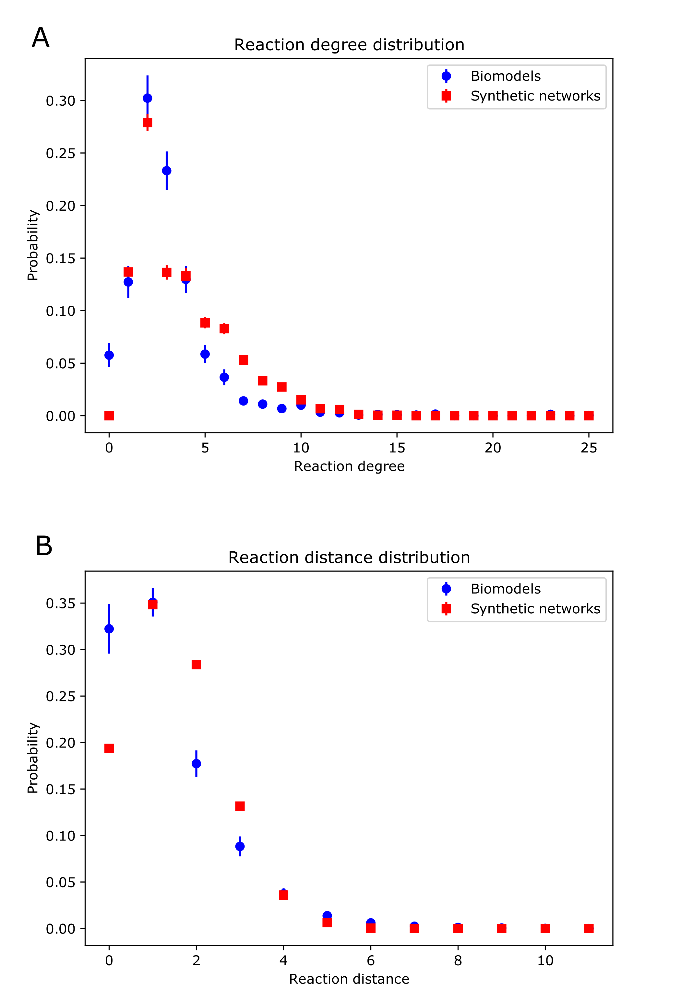

.. _Topology:
 

Topology analysis
===================

-------------------------
Definitions and examples
-------------------------

From the perspective of topology, we first compared the distribution of reaction degree of species, 
defined as the number of reactions one species belonged to. We also observed the distribution of 
reaction distance between a random pair of species, defined as the minimum number of reactions 
between the two species. As an extreme case, if two species belonged to one reaction, the reaction 
distance was zero. The figure below shows the two topological distributions of our generated synthetic 
random signaling networks compared with the signaling networks from the BioModels Database.

-------------------
Code availability 
-------------------

The Python scripts for the topology analysis of reaction degree distributions and reaction distance 
distributions were also available on 
`GitHub <https://github.com/sys-bio/artificial_random_signaling_network/tree/master/topology_analysis>`_. 
The code made use of libSBML with a zip file of SBML files as input and distributions as output.

------
Using 
------

1. **To use the Python script rxn_degree_dist.py to generate reaction degree distributions.**

For example, to analyze a set of SBML files of signaling networks downloaded from the BioModels 
Database.

- First of all, create a folder Biomodels as on GitHub (https://github.com/sys-bio/artificial_random_signaling_network/tree/master/topology_analysis/degree_dist/Biomodels).

- Then, put the `zip file <https://github.com/sys-bio/artificial_random_signaling_network/blob/master/topology_analysis/degree_dist/Biomodels/Biomodels.zip>`_ of the SBML files into the folder.

- Finally, run the Python script `rxn_degree_dist.py <https://github.com/sys-bio/artificial_random_signaling_network/blob/master/topology_analysis/degree_dist/Biomodels/rxn_degree_dist.py>`_.

- The generated results include the degree distribution data saved as degree_dist.txt, the plot of the degree distribution saved as Degree_Distribution.pdf, and the zip file would also get unzipped as a folder BioModels.

Users can use a similar procedure to generate reaction degree distributions for synthetic signaling 
networks referring to the example on GitHub (https://github.com/sys-bio/artificial_random_signaling_network/tree/master/topology_analysis/degree_dist/synthetic_networks).

2. **To use the Python script rxn_distance_dist.py to generate reaction distance distributions.**

For example, to analyze a set of SBML files of signaling networks downloaded from BioModels Database.

- First of all, create a folder Biomodels as on GitHub (https://github.com/sys-bio/artificial_random_signaling_network/tree/master/topology_analysis/distance_dist/Biomodels).

- Then, put the `zip file <https://github.com/sys-bio/artificial_random_signaling_network/blob/master/topology_analysis/degree_dist/Biomodels/Biomodels.zip>`_ of the SBML files into the folder.

- Finally, run the Python script `rxn_distance_dist.py <https://github.com/sys-bio/artificial_random_signaling_network/blob/master/topology_analysis/distance_dist/Biomodels/rxn_distance_dist.py>`_.

- The generated results include the distance distribution data saved as distance_dist.txt, the plot of the distance distribution saved as Distance_Distribution.pdf, and the zip file would also get unzipped as a folder BioModels.

Users can use a similar procedure to generate reaction distance distributions for synthetic signaling 
networks referring to the example on GitHub (https://github.com/sys-bio/artificial_random_signaling_network/tree/master/topology_analysis/distance_dist/synthetic_networks).

